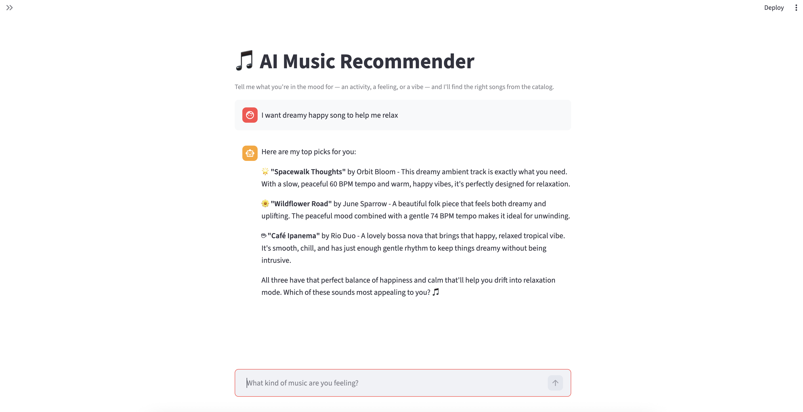
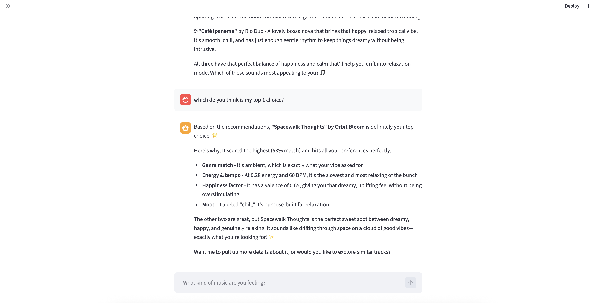
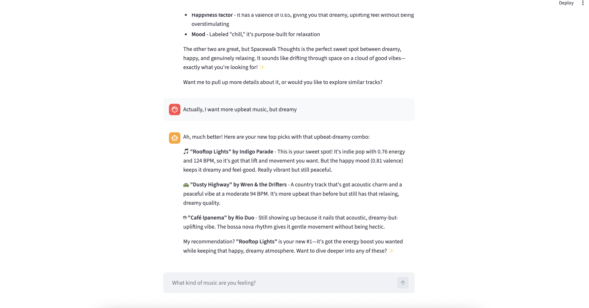
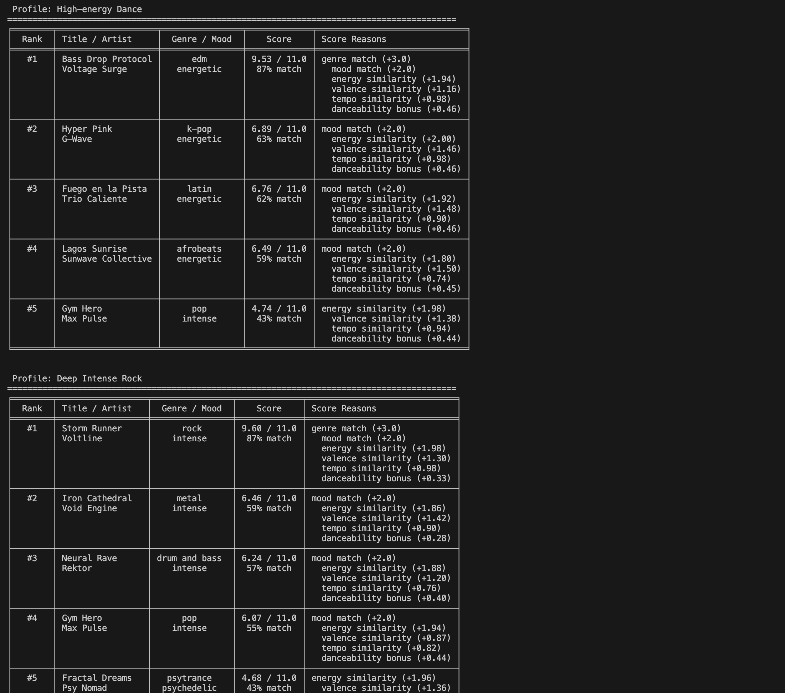

# 🎵 AI Music Recommender Simulation

## Project Summary

MusicMate Finder 2.0 is a content-based music recommender extended into a full applied AI system. It scores songs against a user's taste profile — genre, mood, energy, valence, tempo, and acoustic preference — and returns the top matches with explanations. Users interact through a conversational Streamlit chat interface powered by a Claude agent.

It was updated from MusicMate Finder 1.0, which was simple music recommender simulation. It was originally designed to recommend musics using a scored preference profile given a user's stated preferences — genre, mood, energy level, acoustic taste, valence, and tempo. 

**AI Features:**
- **Agentic Workflow** — Claude agent with tool use that orchestrates multi-step recommendations through natural language conversation
- **Retrieval-Augmented Generation (RAG)** — semantic search over song descriptions using ChromaDB, enabling queries like "music for a rainy afternoon"
- **Specialized Model** — domain-tuned Claude classifier that maps free-form text to structured user preferences

---

## Architecture Overview

The system is built in four layers. User input enters through a **Streamlit chat UI**, which passes natural language to a **Claude Haiku agent** (Agentic Orchestrator). The agent calls three tools as needed: a **Specialized Model** that converts free-form text into a structured preference profile, a **RAG Engine** (ChromaDB + sentence-transformers) that retrieves semantically relevant songs, and a **Scoring Algorithm** that ranks candidates by weighted feature similarity.

```
┌──────────────────────────────────────────────────┐
│               Streamlit Chat UI                  │
│                   (src/app.py)                   │
└─────────────────────┬────────────────────────────┘
                      │ natural language
                      ▼
┌──────────────────────────────────────────────────┐
│           Agentic Orchestrator                   │
│              (src/agent.py)                      │
│         Claude Haiku + tool use                  │
└────────┬──────────────┬──────────────┬───────────┘
         │              │              │
┌────────▼────┐  ┌───────▼───────┐  ┌──▼─────────────┐
│ Specialized │  │  RAG Engine   │  │    Scoring     │
│   Model     │  │  (src/rag.py) │  │  Algorithm     │
│(src/prefer- │  │  ChromaDB +   │  │(src/recommender│
│ence_model   │  │  embeddings   │  │    .py)        │
│   .py)      │  │               │  │                │
└─────────────┘  └───────────────┘  └────────────────┘
```

For full design details see [DESIGN.md](assets/DESIGN.md).

---

## How the Scoring Works

Each `Song` has: `genre`, `mood`, `energy`, `tempo_bpm`, `valence`, `danceability`, `acousticness`.

Every song is scored against the user profile and top results are returned with a breakdown of what drove each score.

**Categorical matches (binary)**

| Feature | Points | Notes |
|---|---|---|
| Genre match | +3.0 | Strongest taste signal |
| Mood match | +2.0 | Situational and intentional |
| Acoustic preference match | +1.0 | When `likes_acoustic` is true and `acousticness > 0.6` |
| Acoustic preference mismatch | -1.0 | When `likes_acoustic` is false and `acousticness > 0.6` |

**Continuous similarity (partial credit)**

| Feature | Max Points | Formula |
|---|---|---|
| Energy | 2.0 | `2.0 × (1 - │target_energy - song.energy│)` |
| Valence | 1.5 | `1.5 × (1 - │target_valence - song.valence│)` |
| Tempo | 1.0 | `1.0 × (1 - │target_tempo - song.tempo│ / 100)` |
| Danceability | 0.5 | Always-on bonus |

**Maximum possible score: 11.0 points**

**Data flow diagram:** [flowchart.md](assets/flowchart.md)

---

## Getting Started

### Prerequisites

- Python 3.12+
- Anthropic API key ([console.anthropic.com](https://console.anthropic.com))

### Setup Instructions

1. Clone the repo and create a virtual environment:

   ```bash
   python -m venv venv
   source venv/bin/activate      # Mac / Linux
   venv\Scripts\activate         # Windows
   ```

2. Install dependencies:

   ```bash
   pip install -r requirements.txt
   ```

3. Add your API key in a `.env` file at the project root:

   ```
   ANTHROPIC_API_KEY=sk-ant-...your-key...
   ```

---

## Running the App

**Streamlit chat UI (AI system):**
```bash
venv/bin/streamlit run src/app.py
```

**Original CLI demo:**
```bash
python -m src.main
```

**Tests:**
```bash
venv/bin/python -m pytest tests/
```

---

## Demo

**AI Music Recommender Demo**




**TOP 5 Recommendation Scoring Demo**



---

## Reliability

All 22 automated tests pass across all four layers. The preference model also outputs a confidence score for each extraction — clear inputs like "something chill for studying" scored 0.93, while vague ones like "music" dropped to 0.45. The AI struggled most when there wasn't enough context to pick a genre.

---

## Limitations and Risks

The catalog only has 40 songs so recommendations get repetitive. Genre and mood use exact string matching, so similar-sounding songs with different labels score as misses. Danceability is always rewarded regardless of preference, which unintentionally favors EDM and hip hop. The preference model also struggles with mixed moods — if you say "upbeat but kind of sad," it picks one and ignores the other.

Misuse risk is low since this doesn't handle sensitive data. The main risk is API key exposure, which is why it's stored in `.env` and excluded from version control.

The most surprising thing during testing was that typing just "music" with no context still returned a full confident-looking profile — the confidence score (0.45) was the only thing that revealed it was basically a guess.

AI was helpful when it suggested using ChromaDB's in-memory mode, which saved a lot of setup complexity. But it also generated test cases that all passed while missing the point — they checked that fields existed, not that the values were reasonable. For example, a test for a high-energy query would pass even if the model returned energy: 0.0. I rewrote those to check actual value ranges instead.

---

## Design Decisions

I kept the original scoring engine completely unchanged and built the new AI layers around it instead of rewriting it. That made it easier to add things one at a time without breaking what already worked.

Each layer lives in its own file and does one thing — the agent handles conversation, the RAG engine handles search, the preference model handles parsing input. I used Claude Haiku instead of Sonnet for both the agent and the preference model because it was fast enough for what I needed and kept costs low. ChromaDB runs in-memory so there's no server to set up, which made things simpler. For the preference model I used few-shot examples in the prompt instead of actual fine-tuning — changing a few examples is a lot easier than training a model, and the output quality was good enough.

I also kept the UI minimal on purpose. The original version had quick-start prompts in the sidebar but I removed them — they felt like extra noise.

---

## Testing Summary

Each AI layer has its own test file: `tests/test_preference_model.py`, `tests/test_rag.py`, and `tests/test_agent.py`.

The trickiest part was figuring out how to test AI outputs. My first instinct was to check for exact values, but that kept breaking because Claude doesn't return the same thing every time. I switched to checking structure instead — that the output is valid JSON, has the right keys, and values are in a reasonable range. That was more stable.

Testing the RAG layer also showed that song description quality really matters. Short descriptions gave worse results, so I went back and rewrote a lot of them to be more specific.

The biggest thing I learned is that passing tests doesn't mean the system actually works well. You still have to look at real outputs and ask whether they make sense — automated tests catch regressions but they can't catch "this answer is technically valid but kind of wrong."

---

## Reflection

[**Model Card**](assets/model_card.md)

Building this showed me that each AI layer is solving a different problem. The scoring algorithm is good at ranking but can't understand "something for a rainy afternoon." RAG can handle that kind of vague input but just returns a list of candidates. The preference model turns natural language into something structured. None of them work well alone — they need each other.

Working with AI tools sped things up a lot, but I still had to review everything carefully. A lot of the test cases looked correct at first glance but were actually testing the wrong thing. The output can look right on the surface and still be missing something. That was probably the most important thing I took away from this — using AI doesn't mean you can skip the careful checking part, it just means you have more time to do it.
